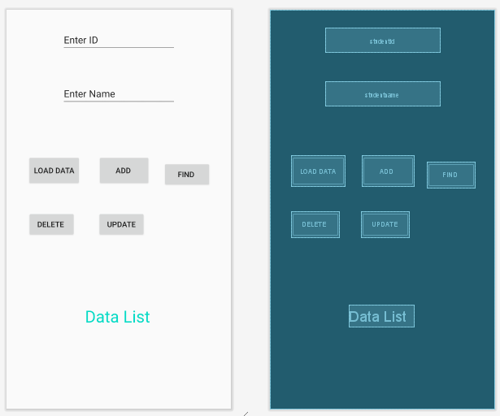
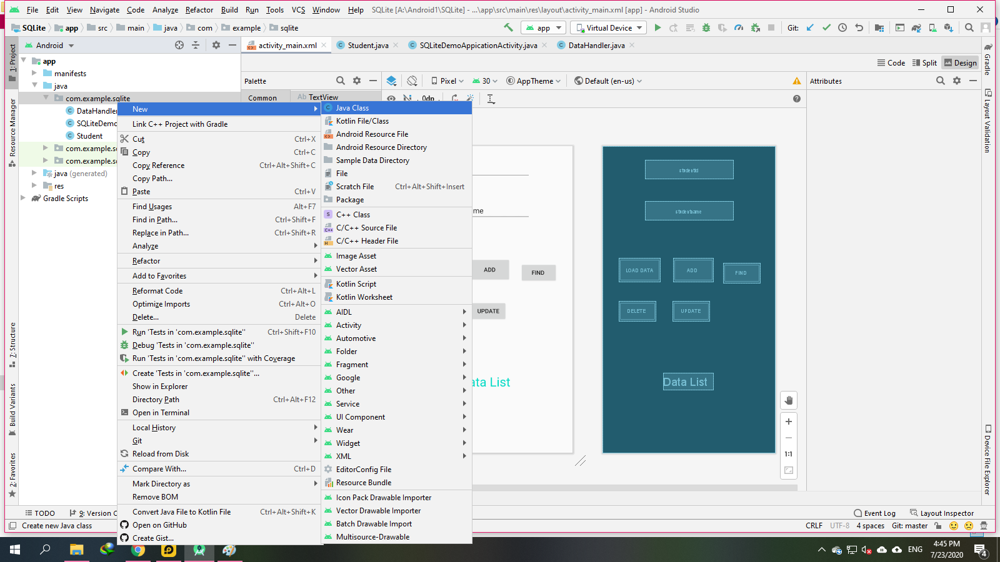
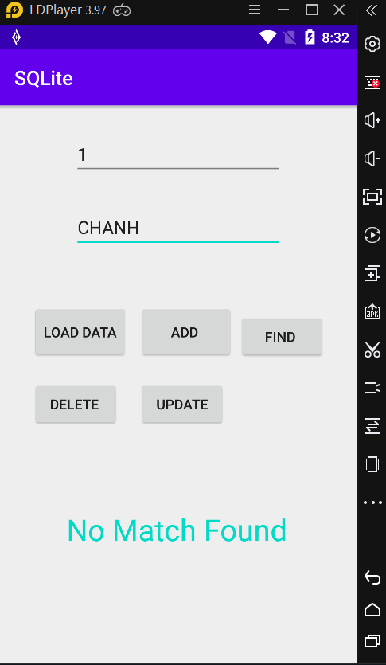
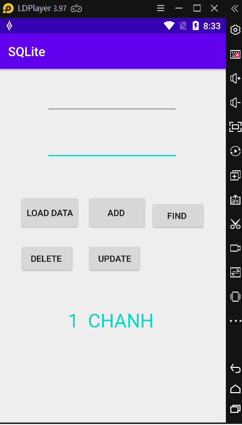
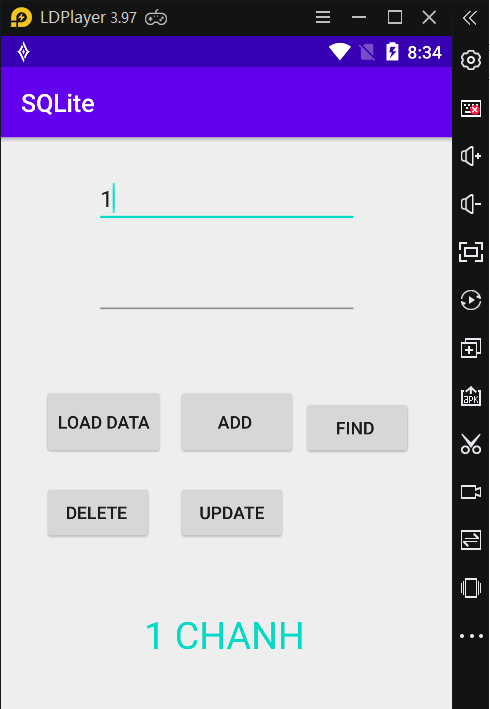
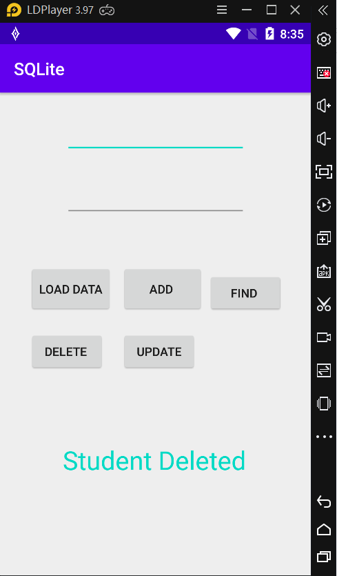
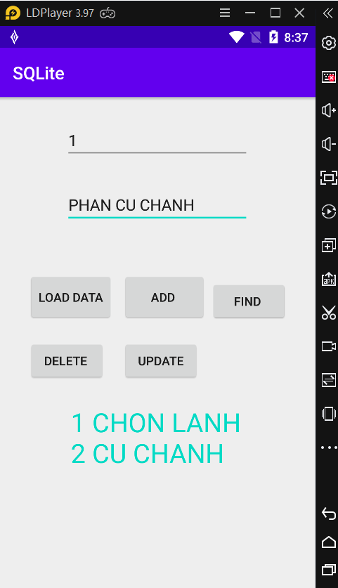
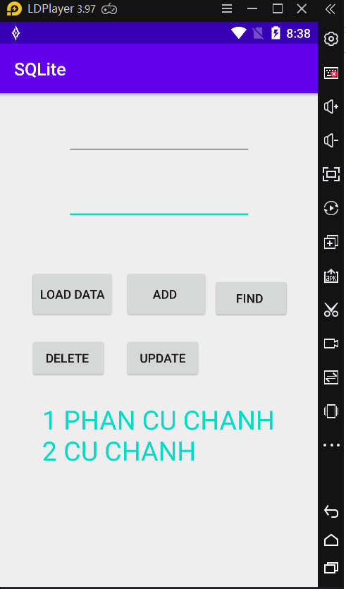

### Lập trình cơ sở dữ liệu trong Android (Phần 1)
- <a href= "https://ngocminhtran.com/2018/11/14/lap-trinh-co-so-du-lieu-trong-android-phan-1/"> Ứng Dụng Từ Bài</a>

### Yêu Cầu
A. MÔ TẢ VỀ Android Studio:

### Hệ quản trị SQLite
- SQLite là hệ quản trị cơ sở dữ liệu quan hệ giống các hệ khác như SQL Server, MySQL, Oracle, v.v. Các hệ quản trị như SQL Server, MySQL, Oracle, v.v. là các hệ xử lý độc lập và ứng dụng sẽ kết nối đến khi cần truy cập dữ liệu. Tuy nhiên, khác với các hệ trên, SQLite là một hệ nhúng với hình thức là một thư viện được liên kết đến ứng dụng.
- Cơ sở dữ liệu SQLite có thể được truy cập bằng cách dùng ngôn ngữ truy vấn SQL (Structured Query Language).
### Các lớp SQLite
- Android SDK cung cấp một tập các lớp hỗ trợ ứng dụng truy cập đến cơ sở dữ liệu SQLite. Có 4 lớp cơ bản cùng với các phương thức được mô tả như bảng

### Tạo ứng dụng dùng SQLite
- Chúng ta sẽ tạo một ứng dụng Android tên SQLiteDemoApplication (tên activity là SQLiteDemoApplicationActivity và tên layout tương ứng là activity_sqlite_demo_application) tương tác với cơ sở dữ liệu tên StudentsDB.db gồm một bảng Students 

### Tạo lớp mô hình dữ liệu (Data model class)
- Để có thể thể tương tác với bảng Students bằng mã Java trong ứng dụng, chúng ta cần chuyển bảng cơ sở dữ liệu thành đối tượng bằng cách tạo lớp Student như sau:

- Tạo lớp tên Student trong gói com.ngocminhtran.sqlitedemoapplication bằng cách nhấn chuột phải vào tên gói chọn New > Java Class

### Tạo lớp xử lý dữ liệu (Data Handler Class)
- Chúng ta đã tạo ra lớp Student, là lớp mô hình dữ liệu từ bảng Students của cơ sở dữ liệu StudentsDB.db. Bây giờ, chúng ta sẽ tạo lớp xử lý các truy vấn dữ liệu. Lớp xử lý dữ liệu, tên DataHandler, kế thừa từ lớp SQLiteOpenHelper, thực thi các phương thức onCreate(), onUpgrade() và các phương thức truy vấn dữ liệu như hiển thị dữ liệu, thêm dữ liệu, xóa dữ liệu hay cập nhật dữ liệu. Để dễ hình dung, mô hình ứng dụng của chúng ta lúc này gồm các lớp

### Sau khi nhập dữ liệu lên TextView ấn button( Add) đã nhập vào dữ liệu

### và đông thời ta ấn phím button (load data)
- sẽ hiện rõ cái mà ta đang nhập ở phần dưới ( Data List) 
- Sau khi chúng ta thực hiện các nút (add)

- xong chúng ta cilck ( Load data) để load lại dữ liệu

- chúng ta tiếp tục với nút khác đương tự
 

- Bạn không thích nữa bạn muốn xóa :

- Bạn muốn sửa:

- bạn sửa thành công:

- Chúng ta thực hiện nút ( Find)

### Tổng kết
- Trong bài viết này chúng ta đã tìm hiểu về hệ quản trị cơ sở dữ liệu quan hệ Android SQLite. Chúng ta cũng đã tìm hiểu các lớp thư viện Android dùng cho việc tương tác giữa ứng dụng Android với cơ sở dữ liệu SQLite và cũng đã thực hiện một ứng dụng minh họa sử dụng các lớp thư viện này. Mã nguồn các tập tin cơ bản của ứng dụng SQLiteDemoApplication

### Chúc Các Bạn Thành Công !!!

- <a href="https://github.com/ChanhMinions/DaoQuanhUngDungAndroid">Dạo quanh ứng dụng Android trong Android Studio 3.X!</a>

                                                                                  ###Trần Phú , Ngày 23 tháng 7 Năm 2020
